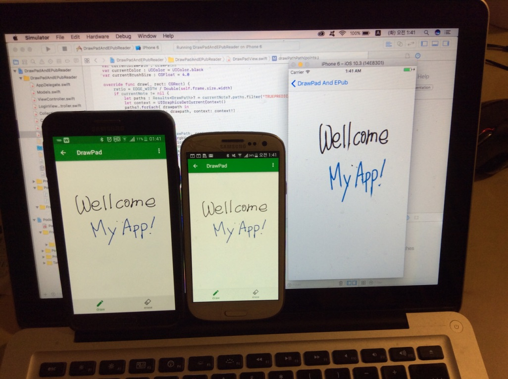
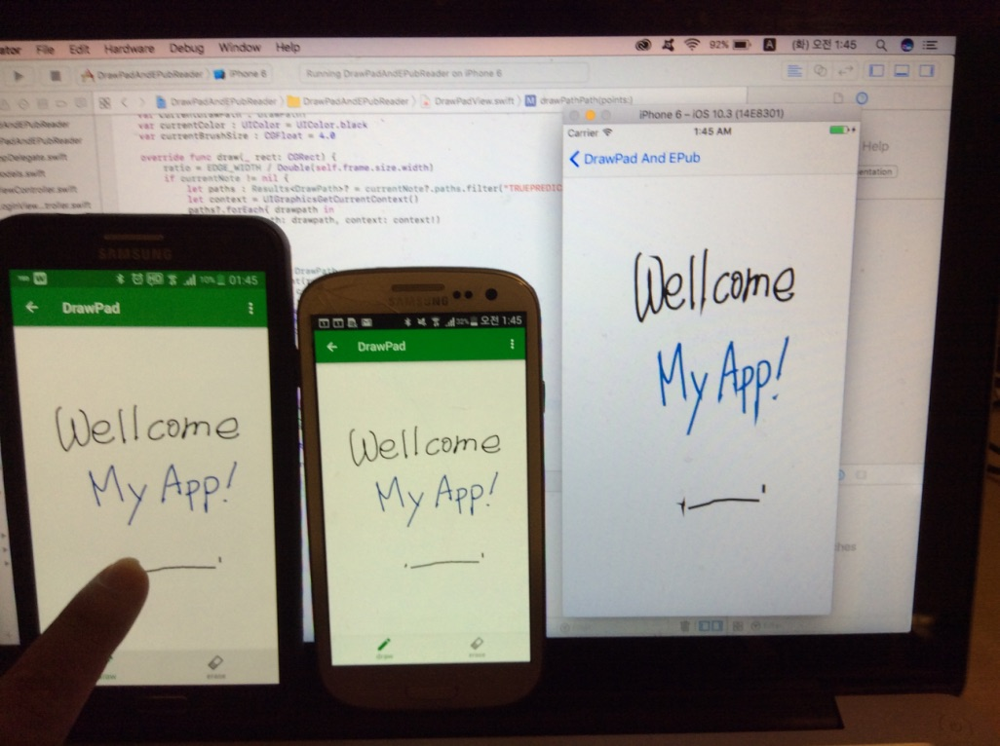

# DrawPadAndEPubReader

Wellcome to visit my gifhub page.

This is my personal project for implementing Android and iOS applications with several features like
- Drawing Pad
- EPub Reader
- Mobile Database 
- Realtime Synchronization 

A Realm soultion (https://realm.io) was used for Mobile Database and Realtime Synchronization.
I am developing two mobile applications using the realm libaray.

 - <a href="https://github.com/hosung03/DrawPadAndEPubReader_android">Android (Java) </a> 

 - iOS (swift) 

  
  

